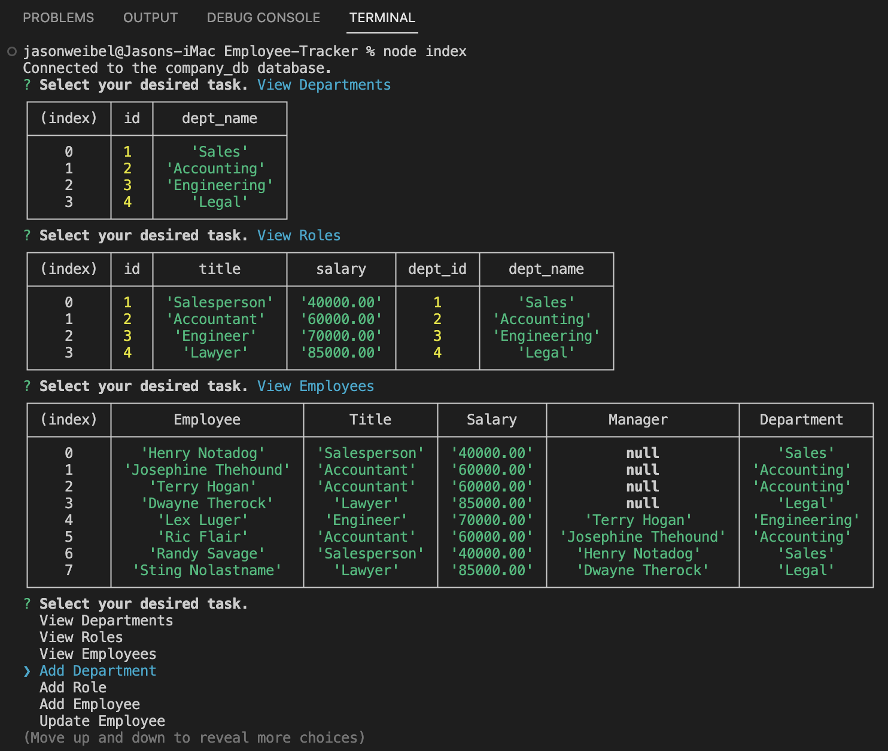

# Employee-Tracker

### [Project URL](https://drive.google.com/file/d/1pFmOcPseUzI2VRjXzVJY1_QQ0Ej-xyaq/view) 

## Table of Contents
- [Project Description](#description)
- [Installation Instructions](#installation)
- [Usage Instructions](#usage)
- [Contributing Resources](#contribution)
- [Testing Methods](#test)
- [GitHub User Name](#gitHub)
- [Email Address](#email)

## Project Description
A Content Management System (CMS) for employees, managers, roles, and departments using Inquirer and MySQL.

## Installation Instructions
Install Node.js, npm Inquirer package, and MySQL.

## Usage Instructions
Open terminal and type node index.js.

## Contributing Resources
Node.js, Inquirer, MySQL. 

## Testing Methods
VS Code terminal. 

## GitHub User Name
jWeibelbootcamp

## Email Address
weibel.jason@gmail.com

## Licensing 
Apache 2.0
